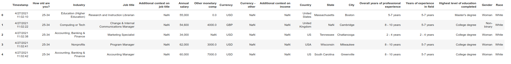

**Data 301**

**Project 1**

## Motivation: Pandas, Exploratory Data Analysis, Data Cleaning, Finding and Merging data

## Environment that I will test on:

python 3.11

## Data:

You are given a snapshot of a Salary Survey from AskAManager.org, see
below for the first 5 rows. It contains 27609 rows, each row has 18
columns (features). Each feature is self explanatory.

## Your tasks

**1. (20 pts) Explore the dataset, handle missing entries as needed.**

**2. (50 pts) Determine the salaries for software developers and
engineers (S/E) in USD.**

This is harder than it sounds because;

a)  The survey collected 'Job Title' information in a freeform text
    field. Consequently the 27609 reported salaries correspond to 14139
    unique 'Job Title's. You have to find as many of the S/E as you can
    via pandas conditional selection (I don't expect perfection here).
    You cannot do this task by hand.

b)  Also, reported salaries are paid in many currencies. Please convert
    to USD. This involves generating a currency converter dataset and
    merging it with the original dataset. (BTW merging datasets is a
    common task). Please don't lose data, so create a new column with
    the Annual salary in USD. Use the currency exchange rates posted on
    1/10/25.

c)  And about that currency dataset, please ensure you have 1 row per
    currency. Many converters will give a conversion rate per country
    for the Euro and they will all be the same. Skip this step and the
    merge you do in step b will result in 1 row generated for every
    instance of euro encountered in your currency conversion dataset.

d)  And a final minor point; the 'Annual salary' field is a string, you
    have to convert it to an int or a float in order to multiply it by
    the currency conversion found in step 2. Be careful to strip out
    special characters (like commas) before you convert.

**3. (20 pts) Determine**

a)  the average S/E salary for each currency

b)  the average S/E salary for each currency based on age

**4. (20 pts) Plot the S/E salaries based on age for the top 4 S/E
currencies represented in your merged dataset.** Make sure each currency
is a different color (seaborn's 'hue' parameter will help here).

## Grading

I will clone your repo and run your notebook end to end in the environment described above.
Please be sure to include the currency translation dataset that your jupyter notebook loads and
merges with the manager dataset.
Points awarded as indicated above.

## APIs that may help

pd.value_counts

pd.merge

pd.to_numeric

Series map

DataFrame apply

re.sub #regular expression package

Series or DataFrame nunique, unique

String lower, strip

seaborn displot , barplot
